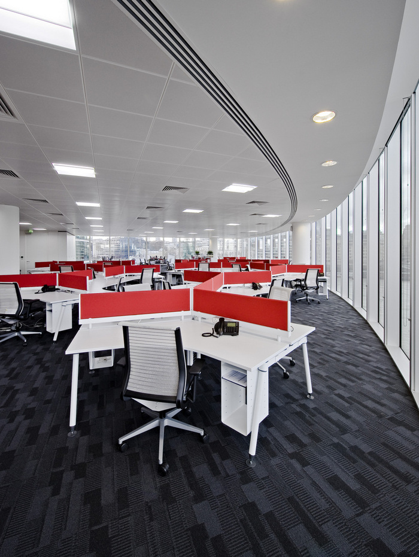

## Inside the London Offices of Hitachi Consulting

<div class="kg-card kg-image-card kg-width-wide">

```grid|2


```

```grid|2


```

</div>

#### Emerging needs

Originally, this organisation of approximately 95 employees was based in Teddington, on the outskirts of London. Their need for a new workspace grew from the company’s strategic goal of becoming a ‘top five’ player in their sector. In this context, the firm recognised the desirability of moving into closer physical proximity to its clients in central London.

The new office could reinforce the Hitachi brand and vision by promoting of dynamism, creativity and excitement, and support a culture of learning. This would have the additional and no less important benefit of making the firm more attractive to potential new talent.

Open-plan architecture would be the key to enabling greater staff collaboration and a high degree of flexibility.
The analysis of end-user routines and technical needs also revealed two distinct working styles in the office – ‘resident’ and ‘mobile’ – which would provide the ergonomic nucleus of the evolving design.

<div class="kg-card kg-image-card kg-width-wide">


</div>

#### Neighbourhood character

To accommodate these diverse needs within a visually and functionally coherent space, the design resolved itself as an array of distinct ‘neighbourhoods’. Where open communication was appropriate, spaces follow an open-plan philosophy, anchored with hubs of clustered desking which encourage the formation of teams and spontaneous exchanges of ideas and information. These areas were located within immediate proximity to main circulation routes, maximising the opportunity for chance meetings, learning and interaction.
Other ‘neighbourhoods’ located further away from main circulation routes cater to occasional and ‘mobile’ end-users. These offer such features as unassigned enclosed spaces configured for use by up to two people at a time. Each provides an acoustically private setting especially suitable for laptop work or sensitive discussions.

#### Convertible spaces

The meeting spaces were designed with an emphasis on versatility, and arrayed around the reception area to allow easy access for clients and consultants alike. “In the interest of sustainability and economy, my design implement parts of the existing fit-out that was in the space – and notably, the existing meeting rooms were incorporated into the new layout. The carpet and fittings in these rooms were reused and coordinated with our scheme,”

Depending on its size, and with virtually no reconfiguration required, each meeting room can be utilised as a bid ‘war room’, a videoconferencing venue, or as a setting for formal gatherings.

<div class="kg-card kg-image-card kg-width-wide">


```grid|2


```

```grid|2


```

```grid|2


```

```````grid|2


``````grid|2


```````

</div>
