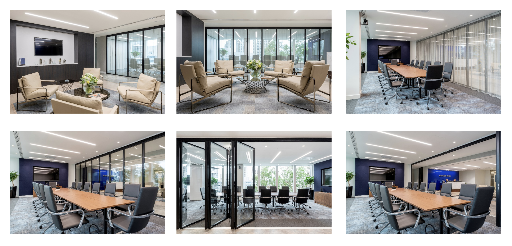
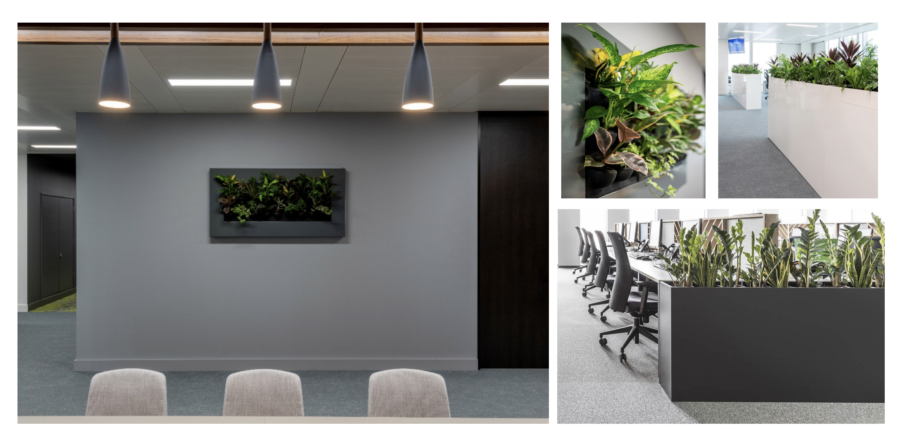
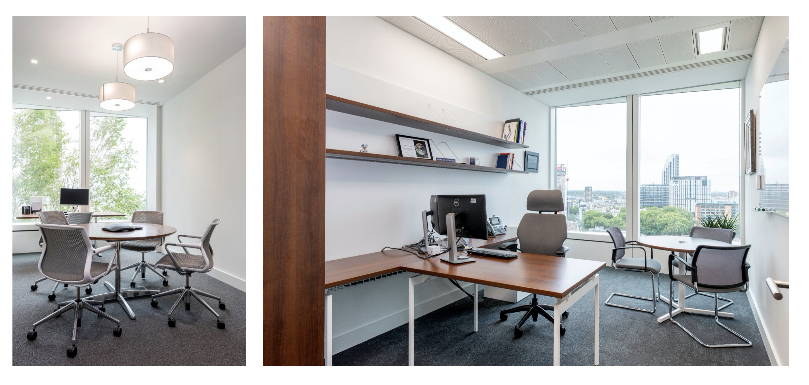
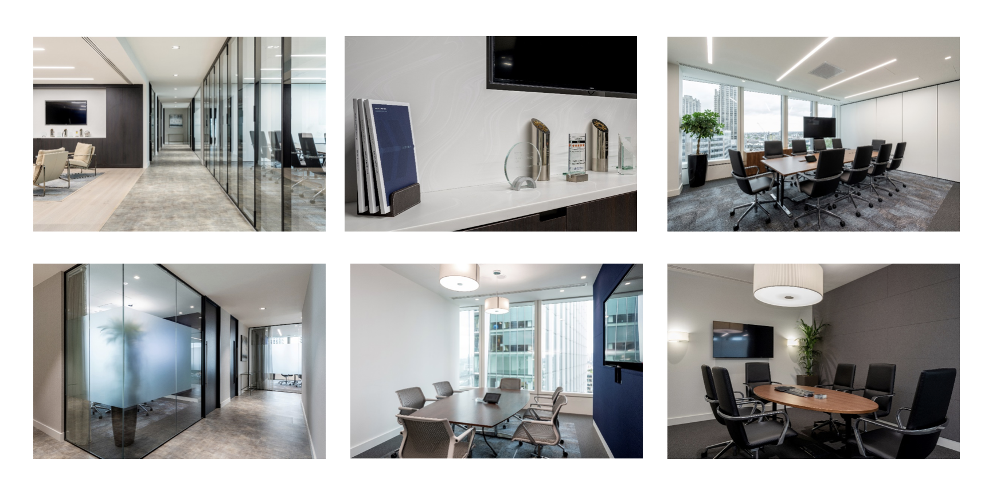
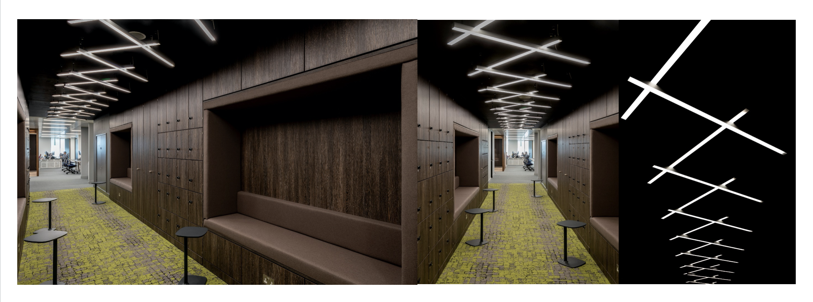

### Design Challenges & Considerations
Having already designed Raymond James' first heaquarters gave me a head start with this project. I could bring a good understanding of their identity, needs and values to the table, while having already estabilished a positive and trusting relationship with the client.

With the previous headquarters I had introduced modern practices to the more conservative setting of a financial firm. With this new headquarters I had the chance to push the boundaries and introduce a more progressive and bespoke design.

 
 

As it's often the case, the thorough understanding of the different personalities is the key to create a design which fully meets the employees' needs. The most important breakthrough has been the introduction of *quiet zone* areas for people who get easily distracted in open-plan environments.
Moreover, I have introduced unique-looking spaces where employees could unwind and rejuvenate.
Lastly, the shape of the building and the location of service areas naturally created a division between teams, so I had to introduce hub areas to make sure collaboration was possible and effective.

The client was a bit reluctant to accept such a shift in working practices, but the success of the first headquarters motivated them to be open to this evolution, and it payed off in spades.

