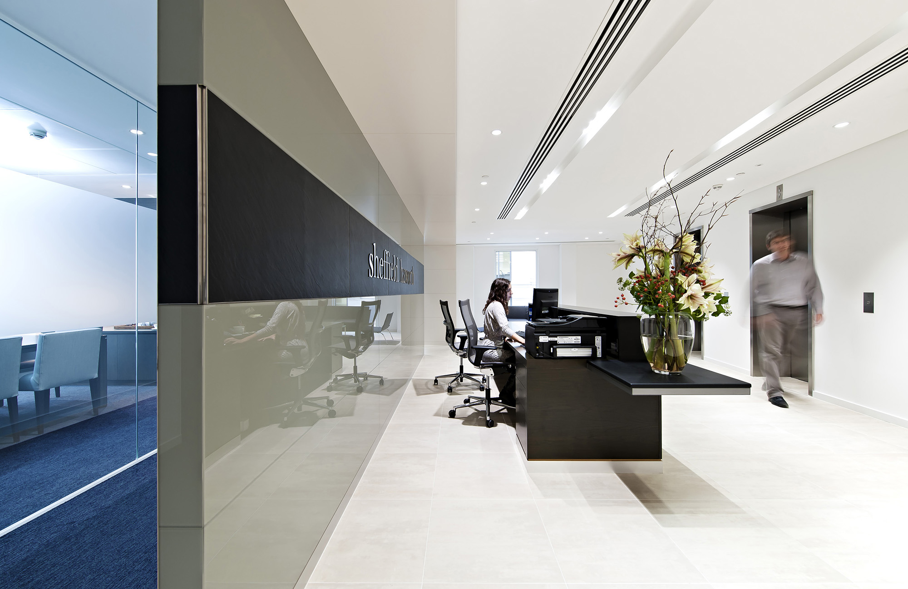
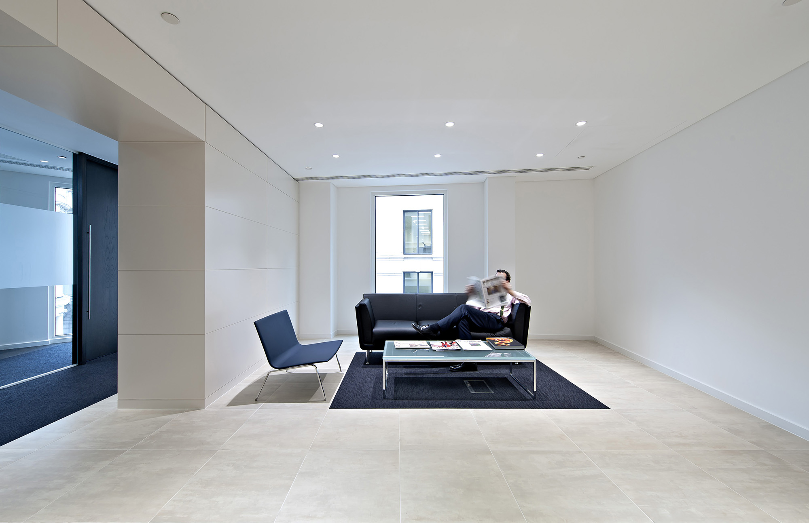
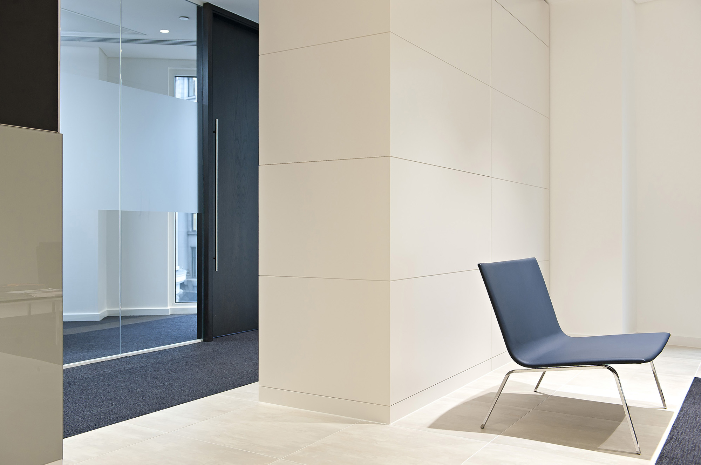
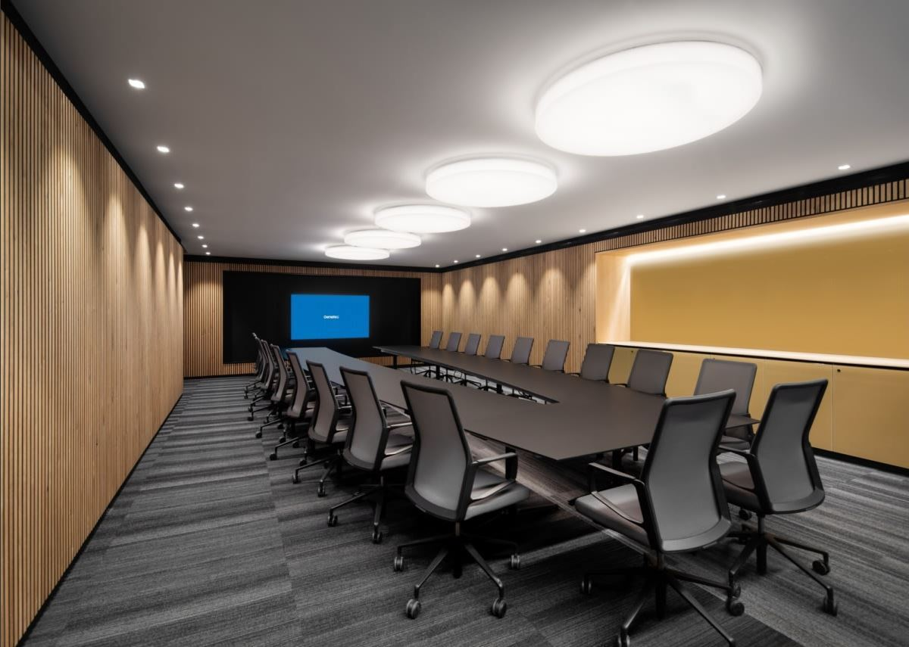
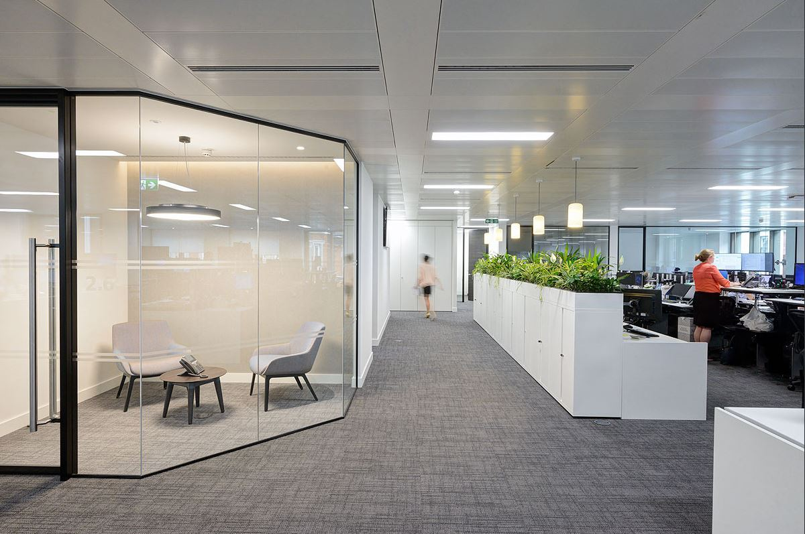
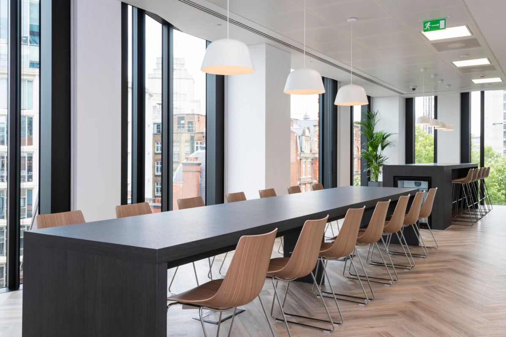

#### Design Challenges

A combination of growth and an expiring lease prompted an executive recruitment firm, Sheffield Haworth, to relocate to new offices in the heart of London and provided them with an opportunity to capture their corporate image through their workplace environment, something they didn’t previously have.
M Moser Associates were appointed to design and fit out the Category A space to accommodate 76 staff with private offices, and provide both formal and informal meeting rooms for interviews to be held in the strictest confidence.

#### Creative Solutions

As the lead designer of the project, I emphasised the privacy aspect by creating acoustically treated, high performance, meeting rooms. These were set as part of the front of house reception area, to convey both a contemporary and elegant feel, reflective of Sheffield Haworth’s business partners and clients.
In order to balance out these monochromatic and formal spaces, I have made sure that the staff teapoint and interview rooms were all about fun, warm colour, and staff collaboration.

